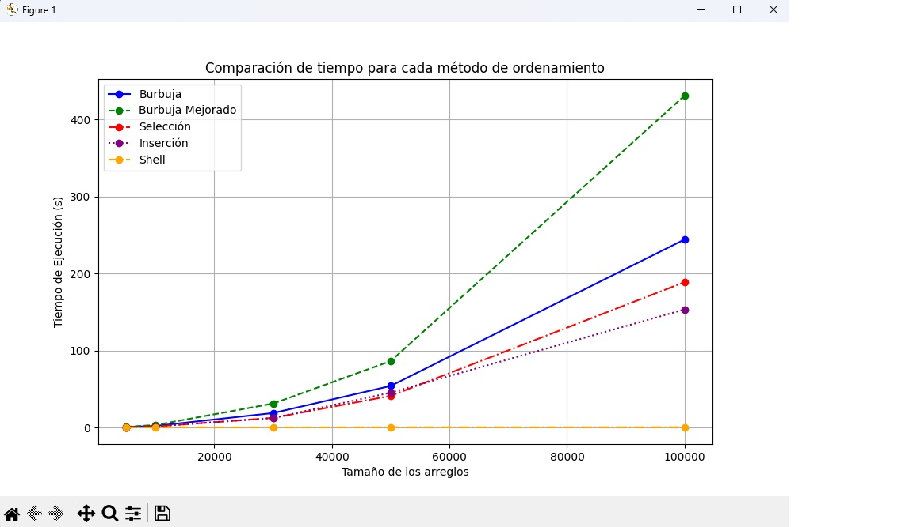

# icc-est-u1-Algoritmos-de-Ordenamiento
=======================================
# Algoritmos de Ordenamiento

## Descripción

En este proyecto generamos una aplicación que por cada método de ordenamiento (burbuja, burbuja mejorado,selección, inserción y shell ) y por cada grupo de valores (n cantidad de números aleatorios) presente el tiempo de ejecución.


## Estructura del Proyecto

- app.py: Archivo principal que ejecuta el benchmarking y genera los resultados.

- benchmarking.py: Genera los arreglos base y mide el tiempo de ejecución de los algoritmos.

- metodos_ordenamiento.py: Contiene las implementaciones de los algoritmos de ordenamiento (burbuja, burbuja mejorado, selección, inserción, shell).

- grafica.py: Se encarga de graficar los resultados obtenidos del benchmarking.

## Funcionalidades

- **Generación de arreglos aleatorios**: Se generan arreglos con valores enteros entre 0 y 99,999 para tamaños definidos (5000, 10000, 30000, 50000 y 100000).

- **Ejecución de algoritmos de ordenamiento**: Se aplican cinco métodos distintos de ordenamiento sobre los mismos arreglos.

- **Medición de tiempos de ejecución**: Cada algoritmo es cronometrado para cada tamaño de arreglo.

- **Visualización de resultados**: Los resultados de rendimiento se muestran en una gráfica comparativa que permite analizar cuál algoritmo es más eficiente según el tamaño del arreglo.

## Requisitos

Para ejecutar este proyecto necesitas:

- Python 3.10 o superior

- Matplotlib

## Configuración del Entorno

Asegúrate de tener instalado lo siguiente en tu sistema:

1. Python
- Verifica que Python esté instalado ejecutando:
**Utilizando**: python --version 

- Deberías ver algo como:
**En la terminal**: Python 3.10.12

- Si no está instalado, descárgalo desde https://www.python.org/downloads/.


## Compilación y Ejecución

1. Clona el repositorio o descarga los archivos.
2. Asegúrate de tener Python instalado (preferiblemente 3.10 o superior).
3. Instala `matplotlib` si no lo tienes:


```bash
pip install matplotlib
```

## Contribuir

Para contribuir a este proyecto, por favor crea un fork y envía un pull request, o simplemente abre un issue con tus comentarios y sugerencias.


## EJEMPLO DE ADICIÓN DE DATOS EN ESTE INFORME



## Autores

- [STEVEN BRITO]
- [THALIA SAGBAY]

##  CONCLUCIONES CON TERMINOLOGIA DE NOTACION 
* Thalia Sagbay:
- Al finalizar el proyecto, entendi con mayor claridad que los algoritmos como Burbuja, Burbuja Mejorado, Selección e Inserción tienen un rendimiento menor con grandes volúmenes de datos, ya que su complejidad es 𝑂(𝑛2)O(n 2), lo que quiere decir es que su tiempo de ejecución aumenta rápidamente al crecer el tamaño del arreglo, en cambio el algoritmo Shell Sort es el más eficiente de estos métodos, con una complejidad que, en la práctica, es mejor que 𝑂(𝑛2)O(n 2), lo que lo hace más apto para conjuntos de datos más grandes, como el que ocupamos en el proyecto. 

* Steve Brito:
- Shell Sort presentó un comportamiento más eficiente, con una complejidad que, aunque no tiene un límite exacto definido en notación Big-O, en la práctica es mejor que 𝑂(𝑛2), Su rendimiento mejorado se debe a la disminución en la cantidad de comparaciones e intercambios necesarios durante la ordenación. Para conjuntos de datos grandes recomiendo no usar los algoritmos de ordenamiento de complejidad 𝑂(𝑛2) como Burbuja y Selección y optar por opciones más óptimas como Shell Sort

